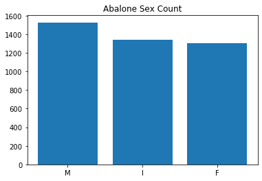
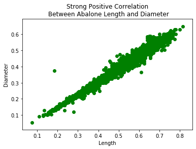
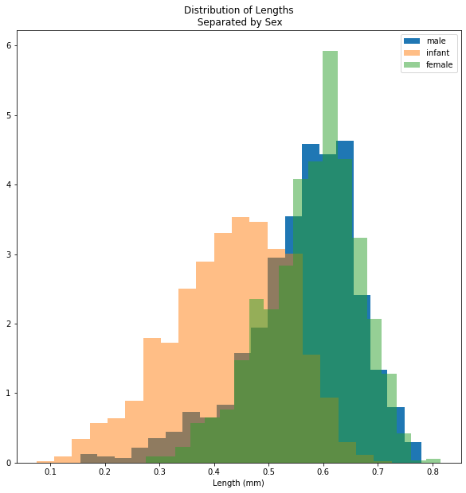
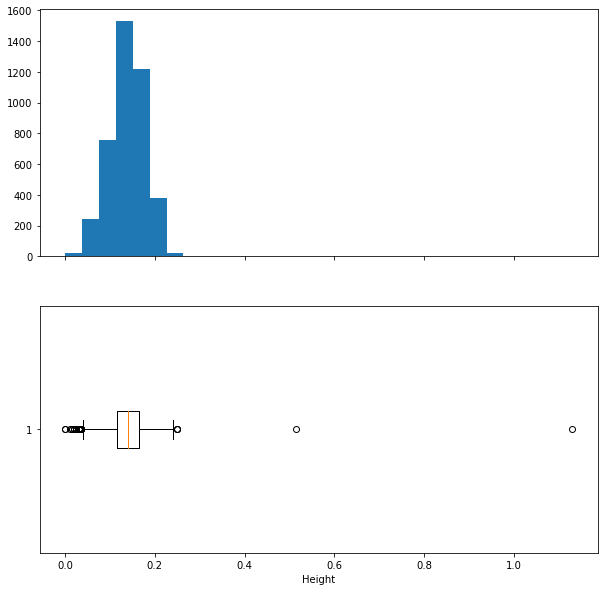

# Essential Matplotlib Plots

For this activity, you will be using an abalone dataset from [UCI Machine Learning Repository](https://archive.ics.uci.edu/ml/datasets/abalone). Abalone are shelled marine animals raised and harvested for food.  This data set describes a little over 4000 abalone collected in Tasmania.  Their physical characteristics have been measured, a process which is described in the link above as "a boring and time-consuming task".  Although we will just be visualizing the data, note that the recommended machine learning application for this data set is "predicting the age of abalone from physical measurements."


```python
# Run cell without changes
import pandas as pd
import matplotlib.pyplot as plt

abalone = pd.read_csv('data/abalone.data', header=None)

abalone.columns = ["sex", "length", "diameter", "height", "whole",
                   "shucked", "viscera", "shell", "rings"]
```

# Task 1

Create a barplot that visualizes the number of instances of each category of abalone `sex`. There are three categories: male, female, and infant. 

Make sure to use fig, ax plt.subplots() syntax. 
Order the plot so that the highest value count is first on the x_axis.


```python
# Your code here
```


```python
#__SOLUTION__
fig, ax = plt.subplots()

counts = abalone['sex'].value_counts()

sex_categories = counts.index
sex_counts = counts.values

ax.bar(sex_categories, sex_counts)
ax.set_title('Abalone Sex Count');
```


    

    


# Task 2

Create a scatterplot that visualizes the correlation between abalone `length` and `diameter`.  Title the plot with a string that includes a short description of the correlation.  Add axis labels.  Color the markers green. 


```python
#__SOLUTION__
fig, ax = plt.subplots()

ax.scatter(abalone['length'], abalone['diameter'], c='g')
ax.set_title('Strong Positive Correlation\n Between Abalone Length and Diameter')
ax.set_xlabel('Length')
ax.set_ylabel('Diameter')
```


    Text(0, 0.5, 'Diameter')


    

    


# Task 3


Create a single plot which layers histograms on top of eachother. Created three subsets of the abalone data set, each representing a different sex.  Then plot the distributions of each sex group's `length` feature using ax.hist.  

To make the plot look better, add a label to each plot that indicates male, female, or infant.  Set the alpha level of the top two plots to .5 to make them semitransparent.  Set `density= True` and `bins=20`.  Call legend() off of the ax object to show the legend aligned to the label.  Give the plot a title and labels.


```python
#__SOLUTION__
abalone_male = abalone[abalone['sex'] == 'M']
abalone_infant = abalone[abalone['sex'] == 'I']
abalone_female = abalone[abalone['sex'] == 'F']

fig, ax = plt.subplots(figsize=(10,10))

ax.hist(abalone_male['length'], density=True, bins=20, label='male')
ax.hist(abalone_infant['length'], density=True, bins=20, alpha=.5, label='infant')
ax.hist(abalone_female['length'], density=True, bins=20, alpha=.5, label='female')

ax.set_title('Distribution of Lengths\n Separated by Sex')
ax.set_xlabel('Length (mm)')
ax.legend();

```


    

    


# Task 4

For the final task, create a single figure with two plots.  The figure should have 2 rows and 1 column, which you specify with the first two arguments of the subplots() method. Go ahead and make the figure bigger (10,10) using the `figsize` argument.  In row 1, plot a **histogram** of the `height` variable. In row 2, plot a **boxplot** of the `height` variable. 


```python
#__SOLUTION__

fig, (ax1, ax2) = plt.subplots(2,1, figsize=(10,10), sharex=True)
ax1.hist(abalone['height'],bins=30)
ax2.boxplot(abalone['height'], vert=False, showfliers=True)
ax2.set_xlabel('Height', );
```


    

    

